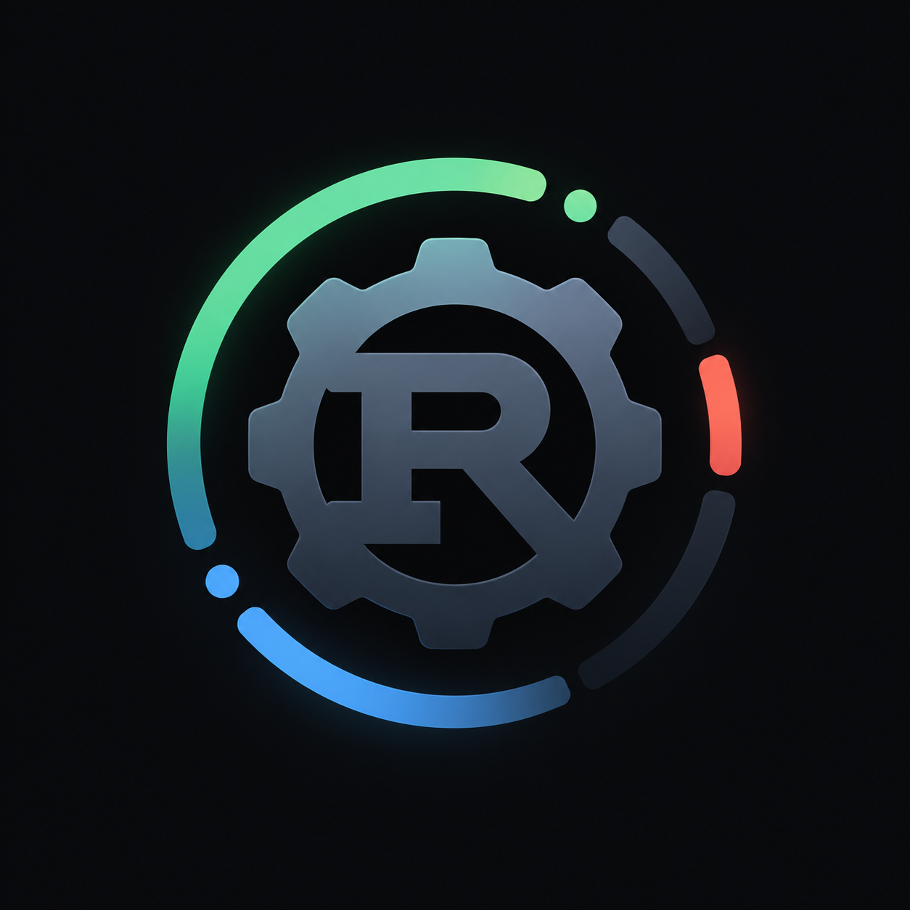
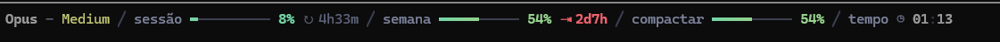

<p align="center">
  
</p>

# status_cli

[](https://github.com/Isllanrx/status_cli/actions/workflows/ci.yml)
[](https://github.com/Isllanrx/status_cli/releases/latest)
[](LICENSE)

A status line for [Claude Code](https://code.claude.com/docs/en/statusline), the
[Antigravity CLI](https://www.antigravity.google/docs/cli/statusline) (`agy`) and the
[Codex CLI](https://github.com/openai/codex). It shows how much of your usage limits you have spent, how close the
conversation is to auto-compact and how long the session has been running, right-aligned at the bottom of the
terminal.



One binary written in Rust, statically linked on Linux. It needs no runtime, makes no network calls and spends
well under a millisecond of its own work per refresh.

## Install

Linux and macOS:

```sh
curl -fsSL https://raw.githubusercontent.com/Isllanrx/status_cli/main/install.sh | sh
```

Windows (PowerShell 5.1 or 7, no administrator needed):

```powershell
irm https://raw.githubusercontent.com/Isllanrx/status_cli/main/install.ps1 | iex
```

The installer picks the binary for your system and architecture, checks its SHA-256 against the release, places it
in `~/.local/bin` and runs `status_cli setup`, which configures every host it finds and keeps a `.bak-status_cli`
copy of each file it changes. On Windows the folder is added to `PATH`; on Linux and macOS the host settings point
at the binary's full path, so `PATH` does not matter. Open a new session afterwards.

To install by hand, download your platform's binary from the
[latest release](https://github.com/Isllanrx/status_cli/releases/latest), save it on `PATH` as `status_cli` and run
`status_cli setup`. To update, run the install command again. To remove it, delete the binary and restore the
`.bak-status_cli` copies.

## Hosts

**Claude Code** runs `status_cli` from `statusLine` in `~/.claude/settings.json` (or `CLAUDE_CONFIG_DIR`) every
second.

**agy** runs it from `statusLine` in `~/.gemini/antigravity-cli/settings.json`. agy only refreshes the line when
the agent changes state, so the clock moves with activity rather than every second; it counts from the first entry
of the conversation transcript.

**Codex CLI** cannot run an external status line, so status_cli starts Codex for you. Use `codex-stt` wherever
you would type `codex`; arguments pass through unchanged:

```sh
codex-stt
codex-stt --model gpt-6-luna
```

`codex-stt` is a shortcut that setup places next to the binary (`status_cli codex` does the same). Codex runs in a
pseudo-terminal one row shorter than the window (ConPTY on Windows, openpty elsewhere) and the line is drawn on the
last row of the same terminal:

- keys, mouse, paste and resizes pass straight through, and clicks on the status row are ignored;
- the line is only drawn between Codex frames, so it never splits an escape sequence, link or synchronized update;
- Codex's scroll regions are kept off the reserved row, also across alternate-screen switches;
- the data comes from the session this launch started in the current folder (resumed sessions included, sub-agents
  ignored), with limits matched by window length and context computed the way Codex shows it;
- Codex's exit code is returned and the terminal modes are restored even if it crashes.

`status_cli codex --once` prints the line once for tmux status bars or shell prompts. Setup also enables Codex's
native status line in `config.toml`, keeping comments and other settings, for when Codex is started directly.

## What it shows

| Segment | Meaning |
| --- | --- |
| `Opus - High` | Model and reasoning effort as reported by the host, plus `· fast` in fast mode |
| `sessão` | 5-hour usage window. `↻` is the time until it resets; `⇥` appears when the current pace would use it up first |
| `semana` | Weekly usage window, same markers |
| `compactar` | Claude Code only: how far the context is from auto-compact |
| `contexto` | agy and Codex: share of the context window in use |
| `tempo` | Session duration |

Model names and effort levels come straight from the host, so new models need no update. On agy the windows are
those of the current model's family (`gemini-5h` and `gemini-weekly` for Gemini, `3p-…` for third-party models).
Usage limits only exist on subscription plans and appear after the first reply; until then a segment shows `–`.

Claude Code does not publish its auto-compact threshold. The estimate here is the context window minus 33k tokens,
about 83.5% of 200k; `CLAUDE_AUTOCOMPACT_PCT_OVERRIDE` can only lower it.

## Configuration

Everything works out of the box. These environment variables change the defaults:

| Variable | Effect |
| --- | --- |
| `STATUS_CLI_COLOR` | `truecolor`, `256`, `16` or `none`, for terminals that do not advertise their depth (tmux, screen) |
| `STATUS_CLI_ASCII` | ASCII instead of Unicode glyphs |
| `NO_COLOR` | No colors |
| `STATUS_CLI_LOG` | JSON Lines log with per-phase timings, host, model, effort and the rendered line |
| `STATUS_CLI_CODEX` | Program to run instead of `codex` in `codex-stt` |

## Compatibility

Colors and glyphs adapt to the terminal: 24-bit color where it is advertised (Windows Terminal, iTerm2, WezTerm,
Ghostty, Kitty, Alacritty, Konsole, GNOME Terminal and other VTE terminals), 256 colors on Terminal.app, tmux and
PuTTY, and 16 colors with ASCII glyphs on the Linux console. Under CJK locales box drawing falls back to ASCII,
since those terminals draw it double width. The line never exceeds the terminal width.

Every release runs the binary through cmd, PowerShell 5.1 and 7, Git Bash, sh, dash, bash, zsh, ksh, tcsh, fish and
nushell on Windows, Linux and macOS (x64 and ARM), inside Ubuntu, Debian, Arch, Fedora, Alpine, openSUSE, Rocky and
Amazon Linux containers, and installs it from the published release on each platform.

## Performance

| | Linux | Windows |
| --- | --- | --- |
| Process start to exit | 0.6 ms | 5.5 ms |
| Time spent in status_cli | 0.07 ms | 0.18 ms |

Most of the Windows figure is the operating system creating the process. State is one small file per session in
`status_cli/` under `XDG_RUNTIME_DIR`, `%LOCALAPPDATA%`, `XDG_CACHE_HOME` or `~/.cache`, read once per refresh,
written only when something changes and removed after seven days.

## Development

```sh
cargo fmt --check
cargo clippy --all-targets -- -D warnings
cargo test
```

Each feature in `src/features/` owns its parsing, rendering and tests; `payload`, `state`, `style`, `terminal` and
`layout` are shared. Releases are automatic: bump `version` in `Cargo.toml` and merge to `main`. Once every test,
shell and distro check passes, CI tags the commit, publishes the binaries with `SHA256SUMS` and installs them on
each platform.

## License

[MIT](LICENSE)
